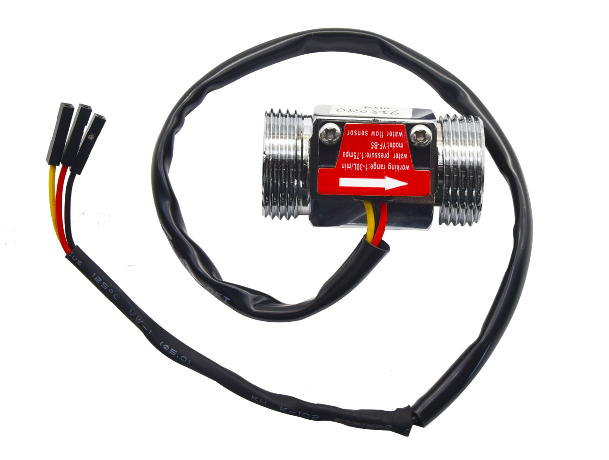

KE3029 WPSE470霍尔水流量传感器+Plus主板+1602屏 套件
===================================================

|image1|

1.产品参数
----------

输出信号：默认输出NPN脉冲信号

型号：YF-B5

接口尺寸：6分（G3/4）

工作电压范围：DC 5～18V

内径/外径：17.9/25.8mm

螺牙长度：11mm

材质：锌合金外壳:raw-latex:`\套热缩套管`

耐水压：≤1.75MPa

输出脉冲高电平：>DC4.7V(输入电压DC 5V)

输出脉冲占空比：50%±10%

绝缘电阻：>100MΩ

流量范围：[ 在1～40L:raw-latex:`\MIN `]±3%

密封性：封闭各孔，加1.7MPa水压试验1分钟无渗漏和变形现象

流量脉冲特性： （6.6*Q）Q=Min±3%

一分钟输出390个左右脉冲

注意：使用时水流的方向需与传感器的箭头方向一致，否则无法测量

