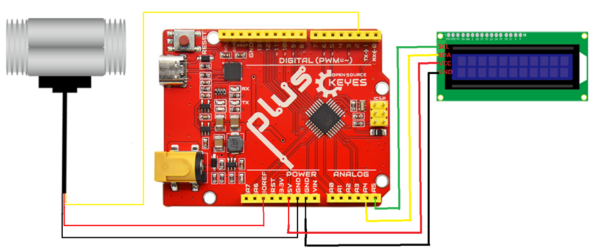

## 2.连接图

| uno控制板 | 水流量传感器   | LCD1602 |
| --------- | -------------- | ------- |
| 5V        | VCC(红线)      | VCC     |
| GND       | GND(黑线)      | GND     |
| A4 (SDA)  |                | SDA     |
| A5 (SCL)  |                | SCL     |
| 2         | 信号线（黄线） |         |

