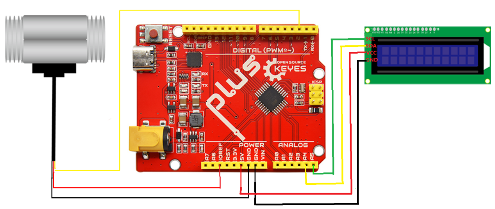

# KE3029 WPSE470霍尔水流量传感器+Plus主板+1602屏 套件


## 1.产品参数

输出信号：默认输出NPN脉冲信号

型号：YF-B5

接口尺寸：6分（G3/4）

工作电压范围：DC 5～18V

内径/外径：17.9/25.8mm

螺牙长度：11mm

材质：锌合金外壳\套热缩套管

耐水压：≤1.75MPa

输出脉冲高电平：\>DC4.7V(输入电压DC 5V)

输出脉冲占空比：50%±10%

绝缘电阻：\>100MΩ

流量范围：\[ 在1～40L\MIN \]±3%

密封性：封闭各孔，加1.7MPa水压试验1分钟无渗漏和变形现象

流量脉冲特性： （6.6\*Q）Q=Min±3%

一分钟输出390个左右脉冲

注意：使用时水流的方向需与传感器的箭头方向一致，否则无法测量

## 2.连接图


|uno控制板|水流量传感器|LCD1602|
|-|-|-|
|5V|VCC(红线)|VCC|
|GND|GND(黑线)|GND|
|SDA||SDA|
|SCL||SCL|
|2|信号线（黄线）||




## 3.测试代码(编码软件版本：arduino-1.8.12）

```

volatile int flow_frequency; // Measures flow sensor pulses
// Calculated litres/hour
float vol = 0.0,l_minute;
unsigned char flowsensor = 2; // Sensor Input
unsigned long currentTime;
unsigned long cloopTime;
#include <Wire.h> 
#include <LiquidCrystal_I2C.h> 
LiquidCrystal_I2C lcd(0x27,16,2); 

void flow () // Interrupt function
{
   flow_frequency++;
}

void setup()
{
   pinMode(flowsensor, INPUT);
   digitalWrite(flowsensor, HIGH); 
   Serial.begin(9600);
   Wire.begin(); 
   lcd.init();
   lcd.backlight();
   lcd.clear();
   attachInterrupt(0, flow, RISING); // Setup Interrupt
   lcd.setCursor(0,0);
   lcd.print("Water Flow Meter");
   lcd.setCursor(0,1);
   lcd.print("Circuit Digest");
   currentTime = millis();
   cloopTime = currentTime;
}

void loop ()
{
   currentTime = millis();
   // Every second, calculate and print litres/hour
   if(currentTime >= (cloopTime + 1000))
   {
    cloopTime = currentTime; // Updates cloopTime
    if(flow_frequency != 0)
    {
      // Pulse frequency (Hz) = 7.5Q, Q is flow rate in L/min.
      l_minute = (flow_frequency / 6.6); // (Pulse frequency x 60 min) / 7.5Q = flowrate in L/hour
      lcd.clear();
      lcd.setCursor(0,0);
      lcd.print("Rate: ");
      lcd.print(l_minute);
      lcd.print(" L/M");
      l_minute = l_minute/60;
      lcd.setCursor(0,1);
      vol = vol +l_minute;
      lcd.print("Vol:");
      lcd.print(vol);
      lcd.print(" L");
      flow_frequency = 0; // Reset Counter
      Serial.print(l_minute, DEC); // Print litres/hour
      Serial.println(" L/Sec");
    }
    else 
    {
      lcd.clear();
      lcd.setCursor(0,0);
      lcd.print("Rate: ");
      lcd.print( flow_frequency );
      lcd.print(" L/M");
      lcd.setCursor(0,1);
      lcd.print("Vol:");
      lcd.print(vol);
      lcd.print(" L");
    }
   }
 }


```


## 4.测试结果

按照上图接好线，烧录好代码，接通水流，上电后，我们可以在显示屏中水流速和流量，如下图。


